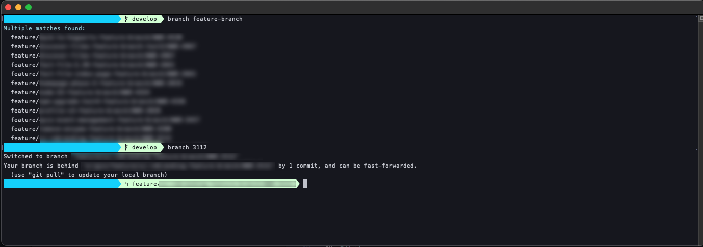

# branch

A Git branch searching and switching utility with intelligent pattern matching.

## Overview

`branch` is a command-line tool that simplifies Git branch management by providing intelligent search and automatic switching capabilities. Instead of typing full branch names or using multiple `git branch` commands, you can search for branches using partial patterns and let the script handle the switching logic automatically.

## Features

- 🔍 **Smart Pattern Matching**: Search branches using partial names, ticket numbers, or keywords
- ⚡ **Automatic Switching**: Instantly switch to branches when there's a single match
- 📋 **Multiple Match Display**: Shows all matches when multiple branches are found
- 🌐 **Remote Branch Fallback**: Searches remote branches when no local matches exist
- 🎯 **Current Branch Detection**: Identifies when you're already on the target branch
- 🎨 **Colorized Output**: Uses cyan highlighting for better readability
- 📖 **Built-in Help**: Comprehensive usage and example information

## Installation

1. Download the `branch` script
2. Make it executable:
   ```bash
   chmod +x branch
   ```
3. Place it in your PATH (e.g., `~/bin/`, `/usr/local/bin/`)

## Usage

### Basic Branch Switching
```bash
branch develop          # Switch to develop branch
branch main             # Switch to main branch
branch feature          # Switch to branch containing "feature"
```

### Pattern Matching Examples
```bash
branch 1234             # Find branch with ticket number "1234"
branch auth             # Find authentication-related branches
branch user-profile     # Find user profile feature branches
branch fix              # Find all branches containing "fix"
```

### Help and Version
```bash
branch --help    # Show detailed help
branch -h        # Show detailed help (short form)
branch --version # Show version information
branch -v        # Show version information (short form)
```

## How It Works

### 1. Local Branch Search
```bash
git branch | grep "$pattern"
```
Searches all local branches for the given pattern.

### 2. Intelligent Response Logic

#### Single Match (Different Branch)
If exactly one branch matches and it's not your current branch:
```bash
git checkout "$matched_branch"
```

#### Single Match (Current Branch)
If the only match is your current branch:
```
You already checked out the only result: * main
```

#### Multiple Matches
If multiple branches match, displays all matches:
```
Multiple matches found:
  feature/user-authentication
  feature/user-profile
  bugfix/user-validation
```

#### No Local Matches
If no local branches match, searches remote branches:
```bash
git branch -r | grep "$pattern"
```

### 3. Remote Branch Fallback
When no local matches exist:
- Searches remote tracking branches
- Displays remote matches if found
- Suggests `git fetch` if no remote matches exist

## Examples

### Successful Branch Switch
```bash
$ branch auth
Switched to branch 'feature/user-authentication'
```

### Multiple Matches
```bash
$ branch feature
Multiple matches found:
  feature/user-authentication
  feature/dashboard-redesign
  feature/payment-integration
```

### Already on Target Branch
```bash
$ branch main
You already checked out the only result: * main
```

### Remote Branch Search
```bash
$ branch hotfix
No local results found. Trying Remote:
  origin/hotfix/critical-bug-fix
  origin/hotfix/security-patch
```

### No Matches Found
```bash
$ branch nonexistent
No local results found. Trying Remote:
No remote results found. Try git fetch.
```

## Advanced Usage

### Ticket-Based Development
```bash
# Working with ticket numbers
branch 5678             # Find branch for ticket 5678
branch ABC-999          # Find branch for ticket ABC-999
```

## Output Format

### Color Coding
- **Cyan**: Informational messages and highlights
- **Default**: Branch names and standard output
- **No Color**: When output is redirected or in non-interactive mode

### Message Types
- `Multiple matches found:` - When search returns multiple branches
- `You already checked out the only result:` - When target is current branch
- `No local results found. Trying Remote:` - When searching remote branches
- `No remote results found. Try git fetch.` - When no matches anywhere

## Error Handling

### Invalid Usage
```bash
$ branch
Usage: branch <branch-name-pattern>
Use 'branch --help' for more information.
```

### Git Repository Check
The script relies on Git commands, so it will fail gracefully if not in a Git repository:
```bash
$ branch test
fatal: not a git repository (or any of the parent directories): .git
```
## Requirements

- **Git repository**: Must be run from within a Git repository
- **Bash shell**: Requires bash for array and string handling
- **Git command-line**: Needs standard Git tools installed
- **Terminal colors**: Best experience with color-capable terminal

## Technical Details

- **Language**: Bash
- **Version**: 1.2
- **Dependencies**: Git command-line tools
- **Compatibility**: Unix/Linux/macOS
- **Exit Codes**: 0 for success, 1 for errors


## Author

John Politowski

---

*Part of a collection of Git utilities for streamlined development workflow.*



