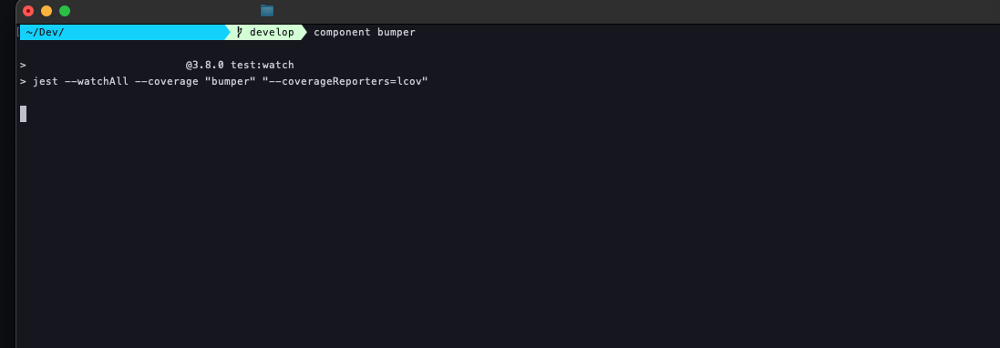

# component

A test runner utility for running component tests with enhanced debugging and coverage reporting.

## Overview

`component` is a command-line wrapper that simplifies running component tests in watch mode with extended debug output and coverage reporting. It's designed for JavaScript projects that need focused testing of specific components with detailed output for debugging.

## Features

- 🧪 **Watch Mode Testing**: Automatically re-runs tests when files change
- 📊 **Coverage Reporting**: Generates lcov coverage reports
- 🔍 **Extended Debug Output**: Sets DEBUG_PRINT_LIMIT to 21,000 for detailed logs
- 🎯 **Pattern Matching**: Target specific tests or components
- ⚡ **Quick Setup**: Single command to run focused tests
- 📖 **Built-in Help**: Comprehensive usage information

## Installation

1. Download the `component` script
2. Make it executable:
   ```bash
   chmod +x component
   ```
3. Place it in your PATH (e.g., `~/bin/`, `/usr/local/bin/`)

## Prerequisites

- **Node.js** and **npm** installed
- **Jest** or similar test runner configured
- **package.json** with `test:watch` script defined

### Example package.json script:
```json
{
  "scripts": {
    "test:watch": "jest --watch"
  }
}
```

## Usage

### Run Tests for Specific Component
```bash
component Button
```
This runs all tests matching "Button" in watch mode.

### Run Specific Test File
```bash
component Header.test
```
This runs the specific test file containing "Header.test".

### Pattern Matching Examples
```bash
# Run all button-related tests
component button

# Run tests for a specific component
component UserProfile

# Run tests matching a pattern
component "auth.*login"

# Run tests in a specific directory
component components/forms
```

### Help and Version
```bash
component --help    # Show detailed help
component -h        # Show detailed help (short form)
component --version # Show version information
component -v        # Show version information (short form)
```

## How It Works

The script executes the following command internally:
```bash
DEBUG_PRINT_LIMIT=21000 npm run test:watch -- "<pattern>" --coverageReporters=lcov
```

### Environment Variables
- **DEBUG_PRINT_LIMIT=21000**: Increases the debug output limit for detailed logging (default is usually much lower)

### Command Breakdown
1. Sets extended debug output limit
2. Runs `npm run test:watch` (your project's watch test script)
3. Passes the test pattern as an argument
4. Adds lcov coverage reporting

## Configuration

### Test Runner Setup
Ensure your `package.json` has a `test:watch` script:

```json
{
  "scripts": {
    "test": "jest",
    "test:watch": "jest --watch",
    "test:coverage": "jest --coverage"
  }
}
```

### Jest Configuration (jest.config.js)
```javascript
module.exports = {
  testEnvironment: 'jsdom',
  collectCoverageFrom: [
    'src/**/*.{js,jsx,ts,tsx}',
    '!src/**/*.d.ts',
  ],
  coverageReporters: ['lcov', 'text'],
  watchPlugins: [
    'jest-watch-typeahead/filename',
    'jest-watch-typeahead/testname',
  ],
};
```

## Examples

```bash
# Test all Button components
$ component Button
# Runs tests in watch mode, shows coverage, extended debug output

# Test specific authentication flows
$ component auth
# Matches any test files or test names containing "auth"

# Test a specific component file
$ component LoginForm.test.tsx
# Runs only that specific test file
```

## Output Features

### Extended Debug Output
With `DEBUG_PRINT_LIMIT=21000`, you get:
- Full error stack traces
- Detailed component render trees
- Complete console.log output
- Verbose test execution details

### Coverage Reporting
- **lcov format**: Machine-readable coverage data
- **Integration ready**: Works with CI/CD pipelines
- **Detailed metrics**: Line, branch, and function coverage

### Watch Mode Benefits
- **Instant feedback**: Tests re-run on file changes
- **Interactive mode**: Filter and focus tests
- **Performance**: Only runs affected tests

## Error Handling

```bash
# Missing test pattern
$ component
Usage: component <test-name-pattern>
Use 'component --help' for more information.

# Invalid project setup
$ component Button
# Will show npm/Jest errors if test:watch script is missing
```

## Technical Details

- **Language**: Bash
- **Version**: 1.1
- **Dependencies**: Node.js, npm, Jest (or compatible test runner)
- **Compatibility**: Unix/Linux/macOS


## Author

John Politowski

---

*Part of a collection of development utilities for streamlined testing workflow.*


