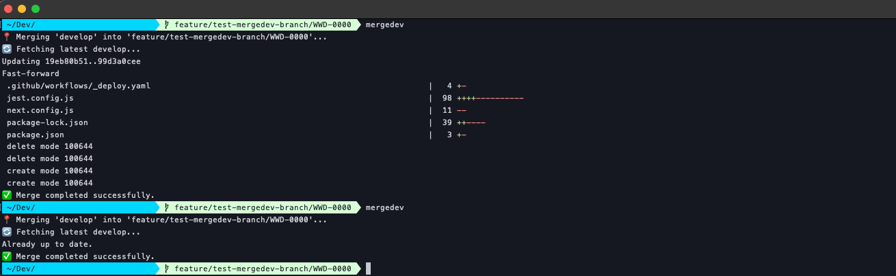

# mergedev

A Git utility for efficiently merging the latest develop branch changes into your current branch.

## Overview

`mergedev` is a command-line tool that streamlines the process of merging the latest changes from the `develop` branch into your current working branch. It fetches the latest develop changes without switching branches and performs an automatic merge, making it perfect for keeping feature branches up-to-date.

## Features

- 🚀 **No Branch Switching**: Fetches develop updates without leaving your current branch
- ⚡ **Efficient Workflow**: Single command to get latest develop changes
- 🛡️ **Safety Checks**: Validates Git repository and prevents running on develop branch
- 📝 **Automatic Commits**: Uses `--no-edit` for seamless merge commits
- 🔍 **Clear Feedback**: Informative status messages and error handling
- 📖 **Built-in Help**: Comprehensive usage information

## Installation

1. Download the `mergedev` script
2. Make it executable:
   ```bash
   chmod +x mergedev
   ```
3. Place it in your PATH (e.g., `~/bin/`, `/usr/local/bin/`)

## Usage

### Basic Usage
```bash
mergedev
```

This command will:
1. Verify you're in a Git repository
2. Check that you're not already on the develop branch
3. Fetch the latest develop branch from origin
4. Merge develop into your current branch
5. Create an automatic merge commit

### Help and Version
```bash
mergedev --help    # Show detailed help
mergedev -h        # Show detailed help (short form)
mergedev --version # Show version information
mergedev -v        # Show version information (short form)
```

## How It Works

The script performs these operations in sequence:

### 1. Repository Validation
```bash
git rev-parse --git-dir > /dev/null 2>&1
```
Ensures you're inside a Git repository.

### 2. Branch Check
```bash
git rev-parse --abbrev-ref HEAD
```
Gets your current branch name and prevents running on develop.

### 3. Efficient Fetch
```bash
git fetch origin develop:develop
```
Fetches the remote develop branch and updates your local develop branch **without switching to it**.

### 4. Merge Operation
```bash
git merge develop --no-edit
```
Merges the updated develop branch into your current branch with an automatic commit message.

## Examples

### Successful Merge
```bash
$ mergedev
📍 Merging 'develop' into 'feature/user-authentication'...
🔄 Fetching latest develop...
✅ Merge completed successfully.
```

### Already on Develop
```bash
$ git checkout develop
$ mergedev
⚠️ You're already on 'develop'. Nothing to merge.
```

### Merge Conflict
```bash
$ mergedev
📍 Merging 'develop' into 'feature/user-authentication'...
🔄 Fetching latest develop...
❌ Merge failed. Resolve conflicts.
```

## Workflow Integration

### Typical Development Workflow
```bash
# Start working on a feature
git checkout -b feature/new-dashboard

# Work on your feature...
git add .
git commit -m "Add dashboard components"

# Before pushing, merge latest develop changes
mergedev

```

## Error Handling

The script handles various error scenarios:

### Not in Git Repository
```bash
$ mergedev
❌ Not inside a Git repository.
```

### Already on Develop Branch
```bash
$ mergedev
⚠️ You're already on 'develop'. Nothing to merge.
```

### Fetch Failure
```bash
$ mergedev
📍 Merging 'develop' into 'feature/new-feature'...
🔄 Fetching latest develop...
# Script exits with error code 1 if fetch fails
```

### Merge Conflicts
```bash
$ mergedev
📍 Merging 'develop' into 'feature/new-feature'...
🔄 Fetching latest develop...
❌ Merge failed. Resolve conflicts and try again.
```

## Requirements

- **Git repository**: Must be run from within a Git repository
- **Origin remote**: Requires `origin` remote pointing to your Git server
- **Develop branch**: Assumes a `develop` branch exists on origin
- **Network access**: Needs connection to fetch from origin

## Technical Details

- **Language**: Bash
- **Version**: 1.1
- **Dependencies**: Git command-line tools
- **Compatibility**: Unix/Linux/macOS
- **Exit Codes**: 0 for success, 1 for errors

### Common Issues

1. **"Not inside a Git repository"**
   - Ensure you're in a directory with a `.git` folder
   - Run `git init` if starting a new repository

2. **"Merge failed"**
   - Resolve conflicts manually and commit
   - Or run `git merge --abort` to cancel

3. **Network/fetch errors**
   - Check internet connection
   - Verify `git remote -v` shows correct origin URL
   - Try `git fetch` manually first

## Author

John Politowski

---

*Part of a collection of Git utilities for streamlined development workflow.*

