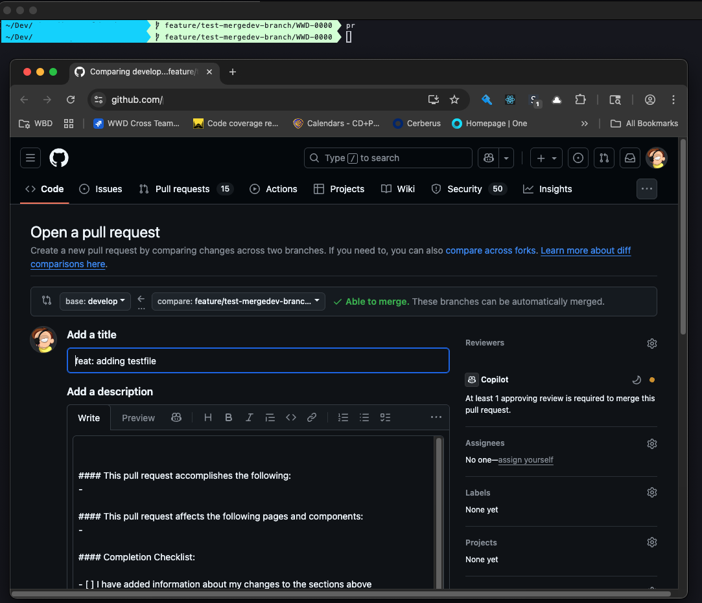

# pr

A GitHub Pull Request URL generator and browser opener utility.

## Overview

`pr` is a command-line tool that automatically opens GitHub's "New Pull Request" page in your default browser for your current branch. It intelligently detects your repository name from Git configuration and constructs the appropriate GitHub URL, making it incredibly fast to create pull requests from the command line.

## Features

- 🚀 **One-Command PR Creation**: Instantly open GitHub PR page for current branch
- 🔍 **Smart Repository Detection**: Automatically extracts repo name from Git remote
- 🏢 **Configurable Organization**: Set your GitHub organization via environment variable
- 🌐 **Browser Integration**: Opens directly in your default browser for immediate use
- 🛡️ **Safety Validation**: Checks Git repository and configuration before proceeding
- 📖 **Built-in Help**: Comprehensive usage and configuration information

## Installation

1. Download the `pr` script
2. Make it executable:
   ```bash
   chmod +x pr
   ```
3. Place it in your PATH (e.g., `~/bin/`, `/usr/local/bin/`)

## Configuration

### Required: Set GitHub Organization

You **MUST** configure your GitHub organization before using the script:

#### Option 1: Permanent Setup (Recommended)
Add to your shell profile based on your system and shell:

**For zsh:**
```bash
echo 'export GITHUB_PR_ORG="your-organization-name"' >> ~/.zshrc
```

**For bash on macOS:**
```bash
echo 'export GITHUB_PR_ORG="your-organization-name"' >> ~/.bash_profile
```

**For bash on Linux:**
```bash
echo 'export GITHUB_PR_ORG="your-organization-name"' >> ~/.bashrc
```

Then reload your shell:
```bash
source ~/.zshrc        # for zsh
source ~/.bash_profile # for bash on macOS  
source ~/.bashrc       # for bash on Linux
```

#### Option 2: Temporary Usage
```bash
GITHUB_PR_ORG="your-org" pr
```

## Usage

### Basic Usage
```bash
pr
```

This will:
1. Detect your current Git repository name
2. Get your current branch name
3. Construct the GitHub PR URL
4. Open it in your default browser

### Help and Version
```bash
pr --help    # Show detailed help
pr -h        # Show detailed help (short form)
pr --version # Show version information
pr -v        # Show version information (short form)
```

## How It Works

### 1. Repository Detection
```bash
git config --get remote.origin.url
```
Extracts the repository name from your Git remote URL.

### 2. Branch Detection
```bash
git rev-parse --abbrev-ref HEAD
```
Gets your current branch name.

### 3. URL Construction
```
https://github.com/{GITHUB_PR_ORG}/{REPO}/pull/new/{BRANCH}
```
Builds the GitHub "New Pull Request" URL.

### 4. Browser Opening
```bash
open "$URL"
```
Opens the URL in your default browser.

**Platform Notes:**
- **macOS**: Uses `open "$URL"`
- **Linux**: Replace with `xdg-open "$URL"` or `sensible-browser "$URL"`

## Error Handling

### Organization Not Set
```bash
$ pr
❌ GITHUB_PR_ORG environment variable is not set.

To make this permanent, add it to your shell profile:
  For zsh: echo 'export GITHUB_PR_ORG="your-organization"' >> ~/.zshrc
  For bash (macOS): echo 'export GITHUB_PR_ORG="your-organization"' >> ~/.bash_profile
  For bash (Linux): echo 'export GITHUB_PR_ORG="your-organization"' >> ~/.bashrc

Then reload your shell: source ~/.zshrc (or ~/.bash_profile or ~/.bashrc)

Or run temporarily with: GITHUB_PR_ORG="your-org" pr
```

### Not in Git Repository
```bash
$ pr
❌ Not inside a Git repository.
```

### No Remote Origin
```bash
$ pr
❌ Could not determine repository name from remote.origin.url
```

## Requirements

- **Git repository**: Must be run from within a Git repository with remote origin
- **Default browser**: Opens in your system's default browser
- **Platform**: Currently designed for macOS (`open` command). Linux users can adapt by replacing `open "$URL"` with `xdg-open "$URL"` or `sensible-browser "$URL"`
- **Network access**: Opens web pages (requires internet connection)
- **Environment variable**: `GITHUB_PR_ORG` must be set


## Technical Details

- **Language**: Bash
- **Version**: 1.1
- **Dependencies**: Git, platform-specific browser opener (`open` on macOS, `xdg-open` on Linux)
- **Compatibility**: macOS (built-in), Linux/Windows (requires minor modification)
- **Exit Codes**: 0 for success, 1 for errors

## Author

John Politowski

---

*Part of a collection of development utilities for streamlined Git workflow.*


