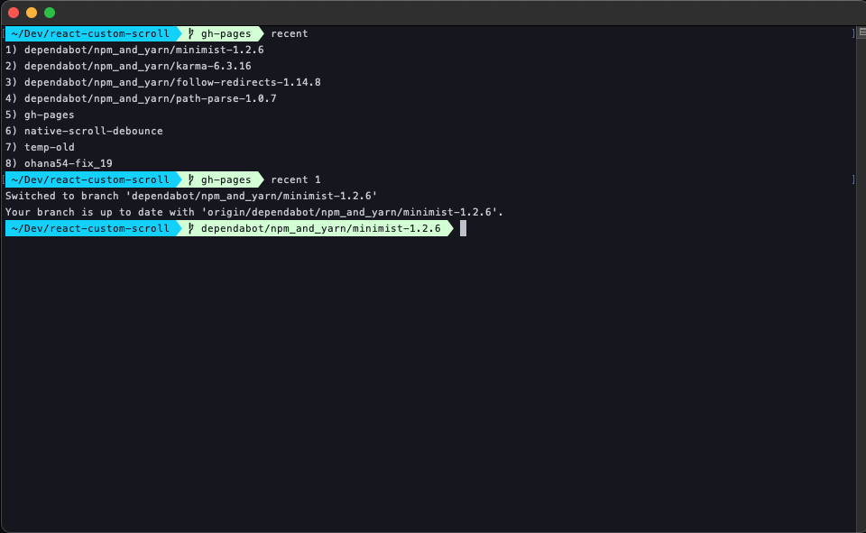

# recent

A Git utility for quickly viewing and switching to your most recent branches.

## Overview

`recent` is a command-line tool that displays a numbered list of your most recent local Git branches (up to 20) and allows you to quickly switch to any of them by number. Perfect for developers who work with multiple feature branches and need fast branch switching.

## Features

- 📋 Lists the 20 most recent local Git branches in chronological order
- 🔢 Numbered interface for easy selection
- ⚡ Quick branch switching by number
- 🛡️ Input validation and error handling
- 📖 Built-in help and version information

## Installation

1. Download the `recent` script
2. Make it executable:
   ```bash
   chmod +x recent
   ```
3. Place it in your PATH (e.g., `~/bin/`, `/usr/local/bin/`)

## Usage

### List Recent Branches
```bash
recent
```
**Output:**
```
1) feature/user-authentication
2) main
3) feature/api-improvements
4) bugfix/login-issue
5) develop
```

### Switch to a Branch by Number
```bash
recent 3
```
This will checkout `feature/api-improvements` (the 3rd branch in the list).

### Help and Version
```bash
recent --help    # Show detailed help
recent -h        # Show detailed help (short form)
recent --version # Show version information
recent -v        # Show version information (short form)
```

## How It Works

The script uses `git for-each-ref` to get branches sorted by commit date:
- **Sorts by**: Most recent commit date (`-committerdate`)
- **Limit**: 20 branches maximum
- **Scope**: Local branches only (`refs/heads/`)

When you select a number, it uses `git checkout` to switch to that branch.

## Examples

```bash
# List all recent branches
$ recent
1) feature/new-dashboard
2) main
3) feature/user-profile
4) bugfix/header-styling
5) develop

# Switch to the 2nd branch (main)
$ recent 2
Switched to branch 'main'

# Invalid input handling
$ recent abc
Invalid input: must be a number or a valid flag

$ recent 99
Invalid branch number
```

## Requirements

- Git repository (must be run from within a Git repo)
- Bash shell
- Git command-line tools

## Error Handling

- **Invalid numbers**: Shows helpful error message
- **Out of range**: Validates branch number exists
- **Non-Git directory**: Git commands will fail gracefully
- **Help flags**: Recognized and handled before processing

## Technical Details

- **Language**: Bash
- **Version**: 1.2
- **Dependencies**: Git
- **Compatibility**: Unix/Linux/macOS

## Author

John Politowski

---

*Part of a collection of Git utilities for streamlined development workflow.*


